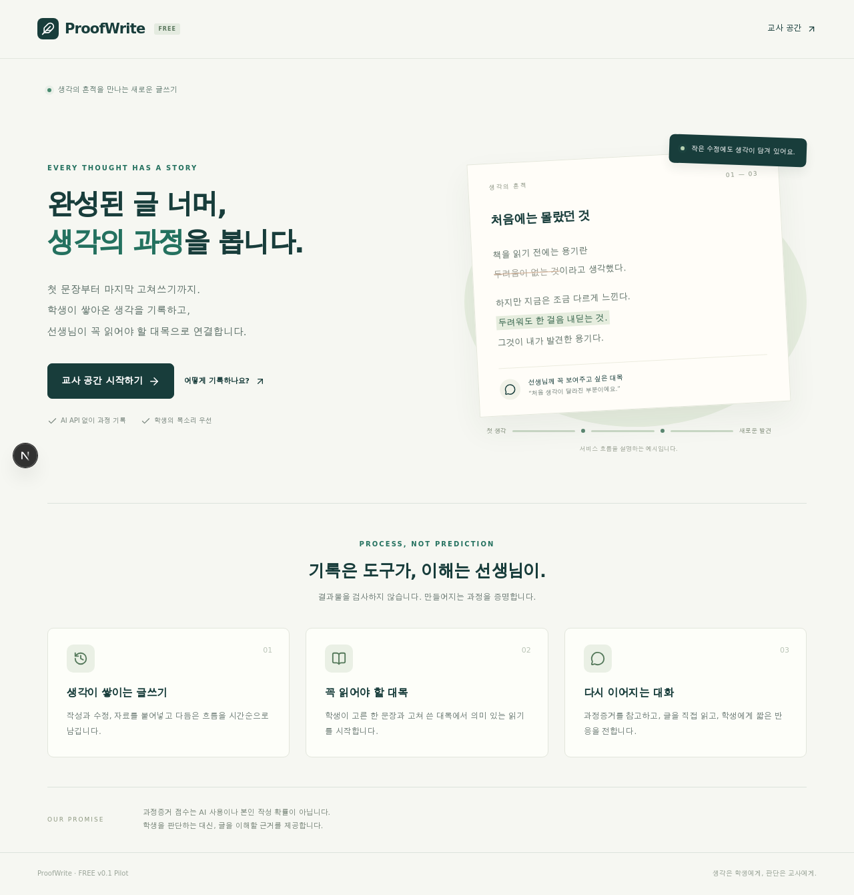
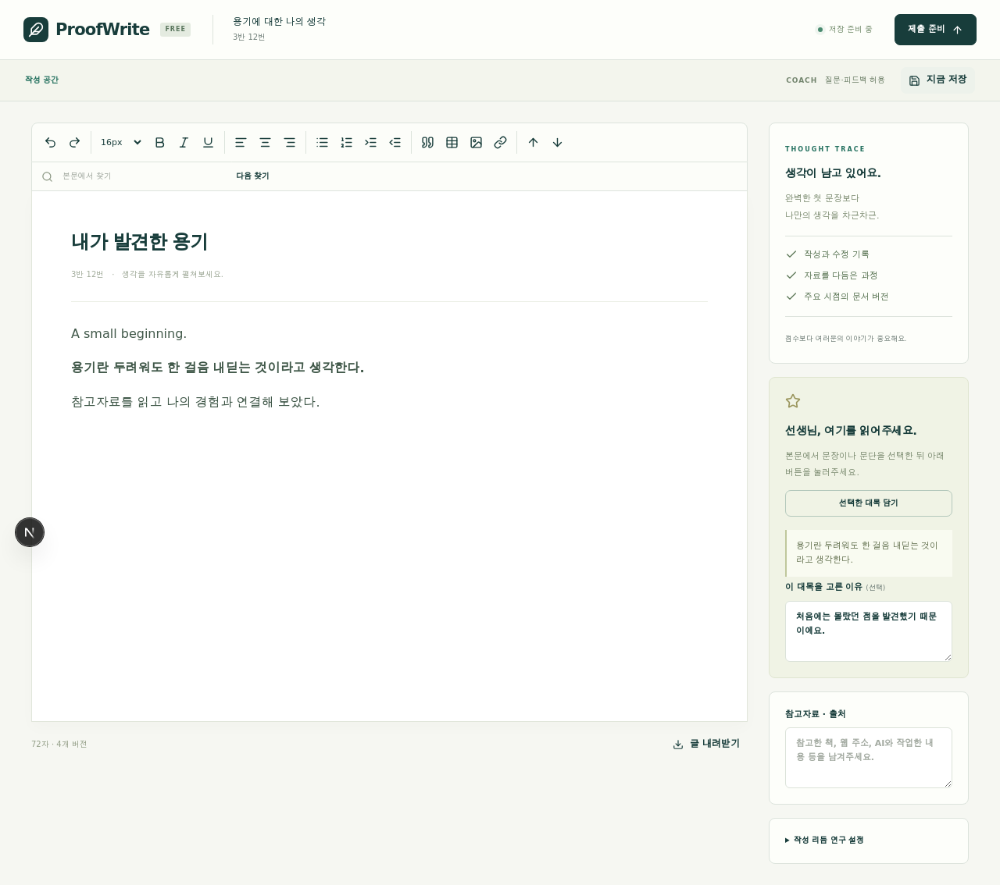
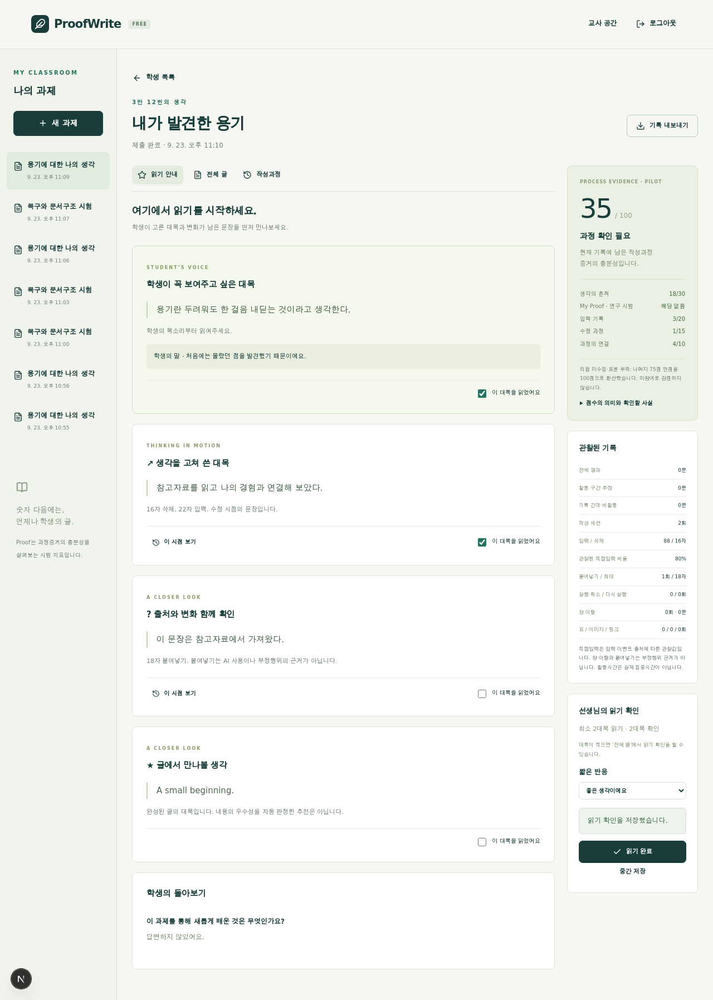

# 실제 코드 점검 — ProofWrite FREE v0.1

점검 기준: GitHub `reichell2000-cmd/proofwrite`, `dev/free-v0.1` 최초 HEAD `3d123d4e64b1fe781f196c19124c926eff61a95f`.

기존 PR #1의 설명을 그대로 전제하지 않고 15개 실제 파일을 읽었습니다. 초기 브랜치는 약 400줄의 기반 코드와 점수 테스트 2개를 가지고 있었지만 Next.js 페이지, Editor, 저장 API, 인증, Replay UI, Dashboard는 없었습니다. 첨부 인계문은 20항 첫 문장에서 끝났으며 보이지 않는 뒤 내용을 추정해 요구사항으로 추가하지 않았습니다.

## 기능별 판정

‘테스트 완료’는 자동화된 범위의 동작 검증입니다. 학교 현장의 ‘실사용 가능’ 인증이나 과학적 정확성 검증을 뜻하지 않습니다.

| 기능                         | 최초 확인                 | 이번 결과   | 코드 증거 / 검증 범위                                                       |
| ---------------------------- | ------------------------- | ----------- | --------------------------------------------------------------------------- |
| Evidence Event Schema        | 부분 구현                 | 테스트 완료 | `core/evidence/types.ts`, 서버 Zod 검증                                     |
| Evidence Collector           | 부분 구현                 | 테스트 완료 | `collector.ts`, `Writer.tsx` transaction·composition 연결, 세션 간 seq 유지 |
| Evidence Summary             | 부분 구현                 | 테스트 완료 | 비활동/세션 분리, blur+hidden 중복 계산 수정                                |
| Thought Trace                | 데이터 구조만 존재        | 테스트 완료 | 변경 steps·스냅샷·서버 재생 일치 검사                                       |
| 온라인 Editor                | 미완료                    | 테스트 완료 | `Writer.tsx`, Tiptap 확장과 실제 브라우저 입력                              |
| 자동저장·재접속              | 미완료                    | 구현 완료   | IndexedDB 복구본, 서버 배치 저장, 충돌 검출                                 |
| Timeline                     | 부분 구현                 | 테스트 완료 | 세션·작성·붙여넣기·수정·버전·창 이탈·정지 marker                            |
| Replay                       | 미완료                    | 테스트 완료 | `replay.ts`, `Replay.tsx`, 문서 재구성·속도·시점 이동                       |
| External Text Transformation | 미완료                    | 테스트 완료 | 문자 잔존·삭제·겹친 수정, undo 복원, 이동 시 추정 표시                      |
| My Proof                     | 부분 구현                 | 부분 구현   | opt-in timing, 현재 과제 두 구간 비교; 실제 기기·정확성 검증 전 연구 시범   |
| Proof Score                  | 부분 구현·테스트 2개 존재 | 테스트 완료 | 무기록 0점, 미수집 N/A, paste/blur 단독 감점 제거, 근거 표시                |
| Teacher Reading Guide        | 부분 구현                 | 테스트 완료 | 학생 대목 우선, 수정·붙여넣기 시점·완성문 대목                              |
| 학생 Highlight               | 설계만 존재               | 테스트 완료 | 실제 본문 선택, 이유, 제출 시 일치 검증                                     |
| 교사 최소 읽기               | 설계만 존재               | 테스트 완료 | 기본 2대목, 1~5대목/전체글 선택, 서버에서도 완료 조건 검사                  |
| 학생 성찰                    | 설계만 존재               | 테스트 완료 | 기본 질문 선택/해제 및 사용자 질문 1개                                      |
| AI 사용정책                  | 설계만 존재               | 테스트 완료 | SOLO / RESEARCH / COACH / COLLAB 과제 저장·학생 표시                        |
| 교사 Dashboard               | 미완료                    | 테스트 완료 | 실제 제출 목록, 상태 필터, 점수·추천, 읽기 확인, 반응                       |
| FREE/PRO flags               | 부분 구현                 | 구현 완료   | FREE 선언, rhythm/guide gates 연결, PRO/장기 신원 모델 OFF                  |
| 인증·학생 접근 분리          | 미완료                    | 테스트 완료 | 교사 cookie, 과제 초대, 문서별 학생 capability cookie, CSRF                 |
| 운영 배포                    | 미완료                    | 미완료      | 실행 문서·Docker/compose 제공; 외부 서버/도메인 배포는 하지 않음            |

## 이번 Pilot에서 구현하지 않은 항목

- ProofLearn Personal, PRO AI 평가·성장·Human/AI 기여율, 장기 My Proof.
- 기관 SSO, 여러 교사/학급 조직 권한, 계정 복구, 수정 요청/재제출.
- 각주 편집, 의미 기반 수정 분석, 문단별 누적 통계의 고급 분석, 문단 추가/삭제와 구간별 속도의 독립 Dashboard.
- 실시간 푸시, 문서 동시 편집, 모바일 오프라인 앱 실행, 대규모 부하 검증.
- 자동 보관 만료·삭제 UI, 암호화 원격 백업, 수집 이벤트의 클라이언트 정직성/신원 검증.

My Proof와 점수 가중치는 현장 calibration이 필요합니다. 문단 이동 후 붙여넣기 잔존량은 추정치이며 의미상 독창성을 측정하지 않습니다. 활동 시간은 편집 사건 사이의 간격에 대한 추정입니다. 학생이 글을 쓴 사실을 독립적으로 인증하지 않습니다.

## 검증 기록

최종 실행 결과는 동일 브랜치의 테스트 코드와 커밋 설명에 기록합니다. 환경은 Node 24 / Linux / Chromium 133. 브라우저 한글 시험은 composition 이벤트를 포함한 자동화 시험이며 Windows/macOS/태블릿의 실제 IME 시험은 별도입니다.

- 핵심 단위·서버 검증 18개 통과.
- TypeScript 검사 및 Next.js production build 통과.
- 교사 생성→학생 한글/붙여넣기/수정→재접속→제출→교사 2대목 확인→학생 반응 조회 통과.
- 교사 미인증 차단, 다른 출처의 요청 차단, 학생 문서 접근 격리 통과.
- 브라우저 시나리오 4개 통과: 전체 제출 흐름, 권한/CSRF, 모바일, 오프라인·구조 편집·탭 격리.
- 오프라인 IndexedDB 저장→재연결 동기화→새로고침 복구 통과.
- 표 행 추가·이미지·링크·문단 이동·Undo/Redo 저장 복구 통과.
- 로컬 저장소 실패를 주입해도 서버 저장이 계속되는 것 확인.
- 데스크톱·태블릿·모바일 화면 캡처 검수 및 가로 넘침 검사.

## 화면 예시

아래 화면은 자동 시험에서 만든 가상 과제와 학생 데이터입니다.

